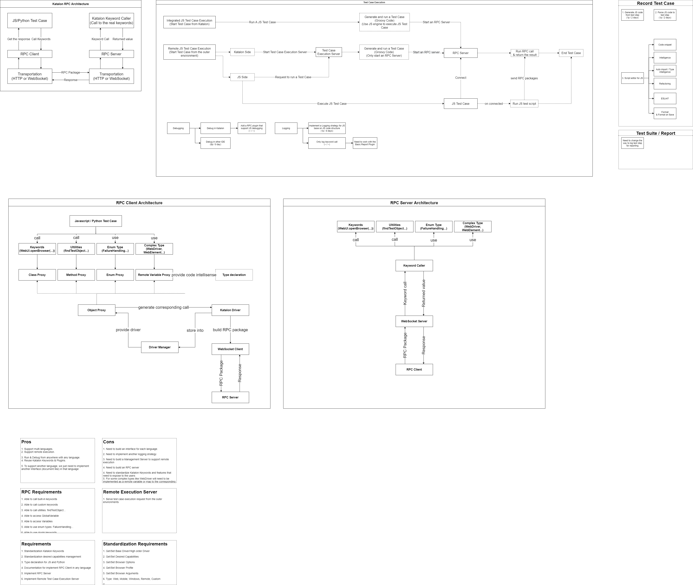

<p align="center">
  <a href="" rel="noopener">
 </a>
</p>

<h1 align="center">Katalon Union</h1>

<div align="center">

[]()
[](https://github.com/kylelobo/The-Documentation-Compendium/issues)
[](https://github.com/kylelobo/The-Documentation-Compendium/pulls)
[](/LICENSE)

</div>

---

<p align="center">
  "Let's write your tests in your most loved languages! 🥳"<br>
</p>

## 📝 Table of Contents

- [About](#about)
- [Getting Started](#getting_started)
- [Usage](#usage)

## 🧐 About <a name = "about"></a>

These are the demos of scripting Katalon test case in Javascript and Python language.

To understand more about these demos, you can refer to the following diagram.
> [][diagram]
> [Katalon RPC Diagram][diagram]

## 🏁 Getting Started <a name = "getting_started"></a>

### Prerequisites

- Python 3
- NodeJS

### Installing

You can install all the dependencies with:

```shell
$ npm i
```

## 🎈 Usage <a name="usage"></a>

1. Open this project with Katalon and run the test **"Start RPC Server"**
2. Run the Javascript demo:<br>
- If you're using VSCode to open this project, then you can switch to **"Run and Debug"** tab and choose **"Node: Current File"**, then open the demo that you want to run and press **[F5]**.<br>
- Or you can run the demo from the terminal with:
```shell
$ node "./Include/Javascript/tests/Web/1. My First Javascript Test Case.js"
```
3. Run the Python demo:<br>
- If you're using VSCode to open this project, then you can switch to **"Run and Debug"** tab and choose **"Python: Current File"**, then open the demo that you want to run and press **[F5]**.<br>
- Or you can run the demo from the terminal with:
```shell
$ python3 "./Include/Python/main.py"
```


[diagram]: https://viewer.diagrams.net/?highlight=0000ff&edit=_blank&layers=1&nav=1&title=JS%20Solution%20Proposal%20architecture%20diagrams.drawio#Uhttps%3A%2F%2Fdrive.google.com%2Fuc%3Fid%3D1a3Y-3mZrw1r7tJdUJX3yhdAunGVOjrXh%26export%3Ddownload